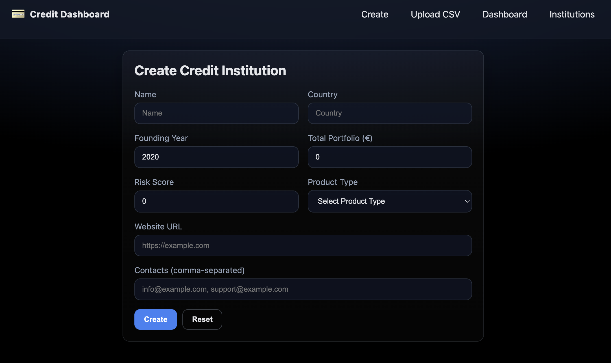

# Credit Dashboard

A full‑stack app to manage credit institutions and their loan portfolios. The backend is a FastAPI service with MongoDB, and the frontend is a Vue 3 + Vite app.

 

## Live Deployment
🚀 Deployed on Render: https://credit-dashboard-8jxr.onrender.com/

The backend serves both the API and the built SPA. Public API endpoints are available under `/api` (e.g. `https://credit-dashboard-8jxr.onrender.com/api/institutions`).

## Features
- Create and list credit institutions
- Upload CSV files with loans for an institution
- Auto‑update loan status when due date expires
- Per‑institution dashboard with totals and status breakdown
- Global dashboard across all institutions

## Tech Stack
- Backend: FastAPI, Pydantic v2, Uvicorn, MongoDB (PyMongo)
- Frontend: Vue 3, Vue Router, Vite, Axios.
- CSV parsing: Pandas
- Docker

## Prerequisites
- Python 3.9+
- Node.js 20+
- MongoDB (Atlas or local). The app expects a connection string in `.env`.

## Setup

### 1) Clone and install
```bash
# Clone
git clone <your-repo-url> credit-dashboard
cd credit-dashboard

# Backend: create venv and install
cd backend
python3 -m venv .venv
source .venv/bin/activate
pip install -r requirements.txt

# Frontend: install deps
cd ../frontend
npm install
```

### 2) Configure environment
Create a file named `.env` in the project root (same level as `backend/` and `frontend/`):

```env
# .env (project root)
MONGO_URI=mongodb+srv://<user>:<password>@<cluster>/<db>?retryWrites=true&w=majority
ENV=development
```

Notes:
- `MONGO_URI` is required. You can also use a local MongoDB URI, e.g. `mongodb://localhost:27017`.
- When `ENV=development`, CORS is allowed for `http://localhost:5173` (Vite dev server).

## Running (development)

### Backend
```bash
cd backend
source .venv/bin/activate
uvicorn main:app --reload
```
Defaults:
- API base: `http://localhost:8000`
- After you build the frontend, FastAPI will also serve the SPA from `frontend/dist`.

### Frontend
```bash
cd frontend
npm run dev
```
Defaults:
- Dev server: `http://localhost:5173`
- Axios base URL is set in `src/main.js` to `http://localhost:8000`.

## Build and Serve (production‑like)
- Build SPA:
```bash
cd frontend
npm run build
```
- Start backend (it will serve `frontend/dist` at `/`):
```bash
cd backend
source .venv/bin/activate
uvicorn main:app --reload
```
Open `http://localhost:8000` in your browser.

## Docker

You can build and run everything (frontend build + backend) via the provided multi‑stage `Dockerfile`.

### Build Image
```bash
docker build -t credit-dashboard .
```

### Run Container (local MongoDB)
```bash
docker run -p 10000:10000 \
	-e MONGO_URI=mongodb://host.docker.internal:27017/creditdb \
	credit-dashboard
```
Then open: http://localhost:10000

Notes:
- Stage 1 builds the Vue frontend with Node 20.
- Stage 2 uses Python 3.10, copies backend + built `/dist` into `/app/static` and launches Uvicorn on port `10000` (mapped to `0.0.0.0`).
- Adjust the exposed port mapping if deploying somewhere that expects `$PORT` (Render sets `$PORT` automatically when using its native build, not the Dockerfile).

### Using Your Own .env
Instead of embedding secrets, pass them at runtime with `-e` or `--env-file`.

## Deployment on Render

Deployment was performed using Render's native Python service (not the Dockerfile) via `render.yaml`:

`render.yaml` excerpt:
```yaml
services:
	- type: web
		name: credit-dashboard
		runtime: python
		rootDir: backend
		buildCommand: pip install -r requirements.txt
		startCommand: uvicorn main:app --host=0.0.0.0 --port=$PORT
```

### How it works
- Render injects `$PORT`; `uvicorn` binds to it.
- Frontend static assets are expected to be present in `backend/static` (so after building locally you can commit or adapt build process).
- Environment variable `MONGO_URI` is configured in the Render dashboard (marked `sync: false` so it is not stored in the repo).

### Alternative: Deploy with Docker
If you want the exact Docker image instead of Render's Python runtime, switch service to `type: web` with `dockerfilePath: Dockerfile` (or enable the Docker tab in the dashboard) and ensure the container listens on `$PORT` (modify `CMD` to `--port=$PORT`).

## Problems Encountered & Solutions

| Problem | Symptom | Solution |
|---------|---------|----------|
| Port mismatch (Render vs local) | Local ran on 8000, Docker image used 10000 | Normalized by letting Docker listen on 10000 and in Render runtime using `$PORT` via `startCommand`. Could adjust Docker CMD to respect `$PORT` for consistency. |
| Static files not served initially | 404 for SPA routes on Render | Ensured frontend build output copied to `backend/static` (or built locally before deploy) and FastAPI `StaticFiles` mount configured (see `main.py`). |
| CORS during local dev (5173 -> 8000) | Browser blocked requests | Added CORS middleware in FastAPI conditioned on `ENV=development` to allow `http://localhost:5173`. |
| Environment secrets (Mongo URI) | Hardcoding risk | Used Render dashboard env var with `sync: false` and documented `.env` usage locally. |
| Different base URLs frontend/backend | Frontend hardcoded `http://localhost:8000` | Plan: use relative `/api` in production and configurable `VITE_API_URL` for non‑co‑located deployments (update pending / partially applied). |

If you run into cold‑start latency on free tier: first request may take a few seconds; keep‑alive pings (cron) can mitigate.

## Screenshots

| Screen | Image | Description |
|--------|-------|-------------|
| Create Institution Form |  | Form to register a new credit institution: name, country, founding year, portfolio size, risk score, product type, website, contacts. Validates basic input and posts to `/api/institutions`. |
| Global Dashboard |  | Aggregated loan metrics across all institutions: total loan amount, invested amount with percentage, and a loans table including status badges (ACTIVE / EXPIRED). Clicking an institution navigates to its detail dashboard. |
| Institutions List |  | Existing institutions with country labels and delete actions (cascade removes related loans). |
| Upload CSV |  | CSV import panel where a user uploads loan data for a specific institution ID; backend parses with Pandas and updates loan portfolio. |

## Tests

### Backend (pytest)
- Stack: pytest, FastAPI TestClient, mongomock.
- What’s covered:
	- Institutions CRUD happy path (create → list → delete).
	- CSV import + dashboard totals and automatic EXPIRED status when due date passes.
- Where:
	- `backend/tests/conftest.py` — overrides the Mongo client with in‑memory `mongomock`, configures app client, and ensures a `static/` dir exists for FastAPI.
	- `backend/tests/test_institutions.py` — institution endpoints flow test.
	- `backend/tests/test_loans_and_dashboard.py` — import CSV and verify dashboard aggregates.
- Run:
```bash
cd backend
source .venv/bin/activate   # if you created venv as in Setup
pytest -q
```
Note: if you see a `urllib3 v2 only supports OpenSSL` warning on macOS/LibreSSL, it’s harmless. Optionally filter via `pytest.ini`.

### Frontend (Vitest)
- Stack: Vitest, @vue/test-utils, jsdom.
- What’s covered:
	- `tests/UploadCSV.spec.js` — validates Institution ID and file selection; on success mocks API call to `/loans/import/{id}` and expects success alert and form reset.
	- `tests/InstitutionForm.spec.js` — submits the create form, renders returned ID, stores it in `localStorage`.
- Notes:
	- All HTTP calls are mocked (module `@/services/api`).
	- In test mode, the DevTools plugin is disabled in `vite.config.js`, to prevent Vitest from crashing.
- Install & run:
```bash
# install deps once
cd frontend
npm install

# run all tests once
npm run test:run

# watch mode / UI (optional)
npm run test
npm run test:ui

# run a specific test file
npm run test:run -- tests/UploadCSV.spec.js
```
Requirements: Node.js 20+ for the frontend, Python 3.9+ for the backend.

## How to Use
1) Create an institution
- Go to `/` (Create). Fill the form and click `Create`.
- You will see the created ID and can copy it or click `Go to dashboard`.

2) Upload loans for an institution
- Go to `Upload CSV`.
- Select a CSV file and paste the Institution ID.
- Click `Upload`.

3) View dashboards
- `Dashboard` shows aggregated loans across all institutions and lets you click an institution name to open its dashboard.
- `Dashboard /:id` shows totals and loan table for the selected institution.

## API Endpoints (summary)
- `POST /institutions` → create an institution. Returns `{ id: string }`.
- `GET /institutions` → list institutions. Each document includes stringified `_id`.
- `DELETE /institutions/{id}` → delete an institution and its loans.
- `POST /loans/import/{institution_id}` (multipart file) → import CSV loans.
- `GET /dashboard/{institution_id}` → get totals and loans for one institution.
- `GET /loans/{institution_id}` → list loans for one institution.

## CSV Format
The CSV parser expects columns similar to:
- `loan_no`, `principal_open_eur`, `loan_last_date`, `status` (derived), etc.

The `utils/csv_parser.py` uses Pandas to parse the uploaded file and attaches `institution_id` to each row. Expired loans are marked automatically when the due date passes.

## License
MIT
